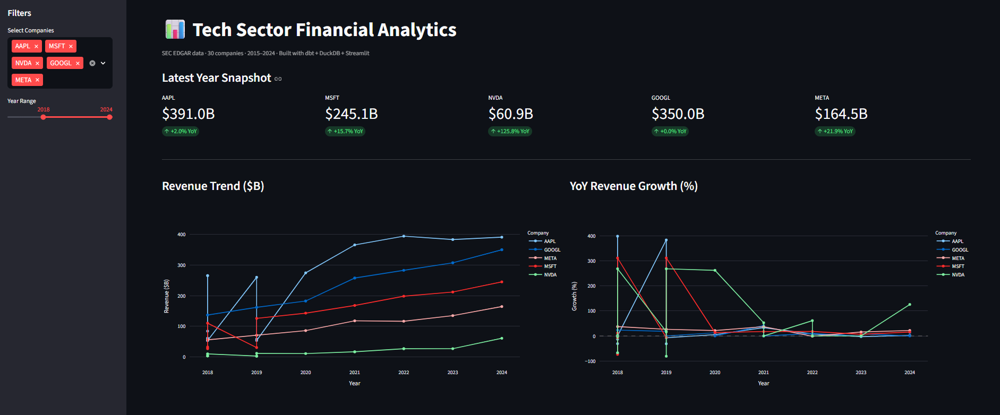
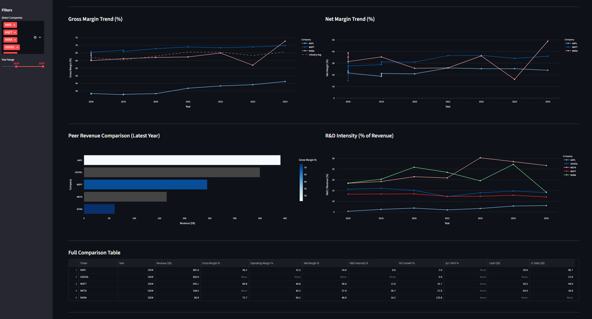

# SEC Financial Analytics Pipeline

End-to-end data engineering pipeline ingesting SEC EDGAR financial filings for
30 tech companies, transforming through a dbt + DuckDB medallion architecture,
and serving a Streamlit analytics dashboard.

## Architecture


```
SEC EDGAR API → Python ingestion → DuckDB (bronze)
→ dbt silver (normalize + pivot + deduplicate)
→ dbt gold (revenue trends, company comparison, margin trends)
→ Streamlit dashboard
```

## Tech Stack

| Layer | Tool |
|---|---|
| Data source | SEC EDGAR XBRL API (free, no key needed) |
| Ingestion | Python, Pandas, Requests |
| Storage | DuckDB (single-file analytical database) |
| Transformation | dbt-duckdb (3 models: silver + 3 gold) |
| Dashboard | Streamlit + Plotly |

## dbt Models

| Model | Type | Description |
|---|---|---|
| `silver_financials` | View | Normalizes 14 financial metrics, deduplicates filings, pivots rows→columns, adds margin calculations |
| `gold_revenue_trends` | Table | YoY revenue growth, peer ranking, revenue scaled to $B |
| `gold_company_comparison` | Table | Latest year snapshot per company, 3yr CAGR |
| `gold_margin_trends` | Table | Gross/operating/net margins vs industry average |

## Data

- 30 tech companies (AAPL, MSFT, NVDA, GOOGL, META and 25 others)
- 36,640 raw financial fact rows from SEC EDGAR
- 14 metrics per company: revenue, gross profit, net income, R&D expense,
  total assets, cash, long-term debt, operating cash flow, and more
- 2015–2024 annual filings (10-K)

## Setup

```bash
git clone https://github.com/ayushchandel93/sec-financial-pipeline.git
cd sec-financial-pipeline
pip install -r requirements.txt

# Add your contact info for SEC API
cp .env.example .env
# Edit .env: SEC_USER_AGENT=YourName your-email@gmail.com
```

## Run

```bash
# 1. Fetch company list
python src/get_companies.py

# 2. Ingest financial data → DuckDB bronze
python src/ingest.py

# 3. Run dbt transformations (silver + gold)
cd dbt_project
dbt run
cd ..

# 4. Launch dashboard
python -m streamlit run dashboard/app.py
```

## Dashboard





## Dashboard Features
- Company selector (multi-select, default: AAPL/MSFT/NVDA/GOOGL/META)
- Year range slider (2015–2024)
- KPI cards with YoY growth delta per company
- Revenue trend line chart
- YoY revenue growth chart
- Gross margin vs industry average
- Net margin trend
- Peer revenue comparison (horizontal bar, color = gross margin)
- R&D intensity over time
- Full comparison table with formatting
- 
## Key Findings
- NVDA revenue grew +125.8% YoY in 2024 — visible in the KPI card
- NVDA gross margin jumped from 57% → 72.7% in 2024 driven by AI chip demand
- MSFT gross margin of 69.8% reflects pure software/cloud business model
- AAPL gross margin (~46.7%) reflects hardware-software mix vs pure software peers
- GOOGL and META invest 14-20% of revenue in R&D — highest intensity in the group
- Identified and resolved duplicate fiscal period reporting in SEC XBRL data —
  deduplication applied at silver layer on latest filed_date per ticker/metric/period
  
## Project Structure

```
src/
├── get_companies.py    # Fetch ticker → CIK mapping from SEC EDGAR
└── ingest.py           # Fetch financial facts → DuckDB bronze layer
dbt_project/
├── models/
│   ├── silver/
│   │   ├── sources.yml
│   │   └── silver_financials.sql
│   └── gold/
│       ├── gold_revenue_trends.sql
│       ├── gold_company_comparison.sql
│       └── gold_margin_trends.sql
dashboard/
└── app.py              # Streamlit dashboard
notebooks/
└── 02_validate_gold.ipynb
```
